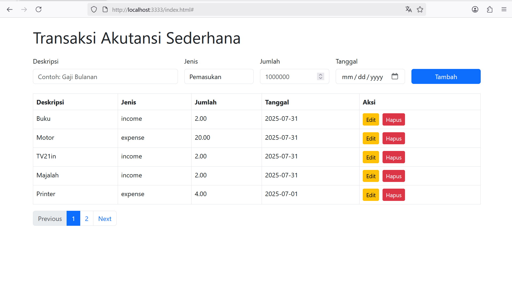

# Aplikasi Akuntansi Sederhana

Aplikasi transaksi keuangan sederhana berbasis web menggunakan:
- Backend: [AdonisJS v5](https://adonisjs.com/)
- Database: MySQL
- Frontend: HTML + [Bootstrap 5](https://getbootstrap.com/)

---
## UI

## Fitur

- Tambah, ubah, hapus transaksi
- Jenis transaksi: **Pemasukan** dan **Pengeluaran**
- Tanggal dan jumlah transaksi
- Pagination

---

## Cara Menjalankan Aplikasi

### 1. Clone repositori
```bash
git clone https://github.com/bahrudin/akuntansi-app.git
cd akuntansi-app
```
### 2. Instal Pustaka
```bash
npm install
```
### 3. Konfigurasi database
```bash
DB_CONNECTION=mysql
DB_HOST=127.0.0.1
DB_PORT=3306
DB_USER=root
DB_PASSWORD=
DB_DATABASE=akuntansi_app
```
### 4. Migrasi database
```bash
node ace migration:run
atau
database/import-manual.sql
```
### 5. Jalankan
```bash
node ace serve --watch
```
### 5. Buka Browser
```bash
Jalankan
```


